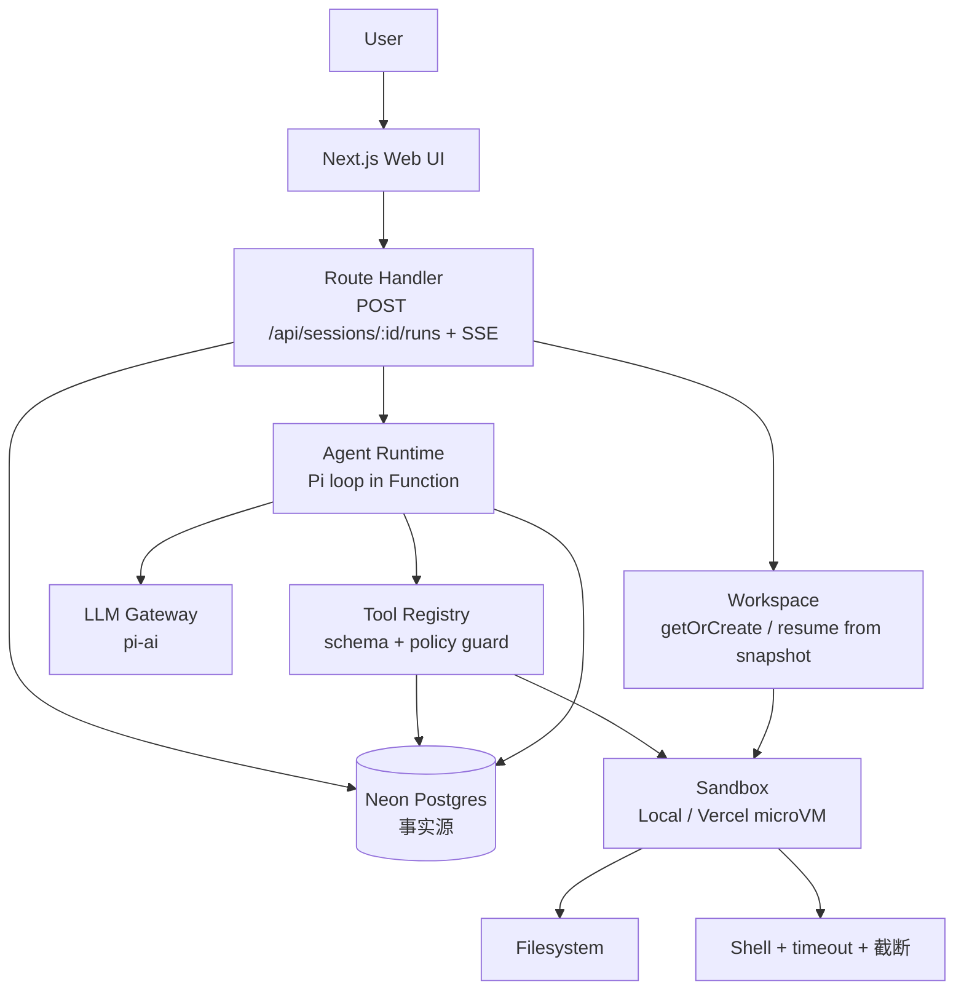
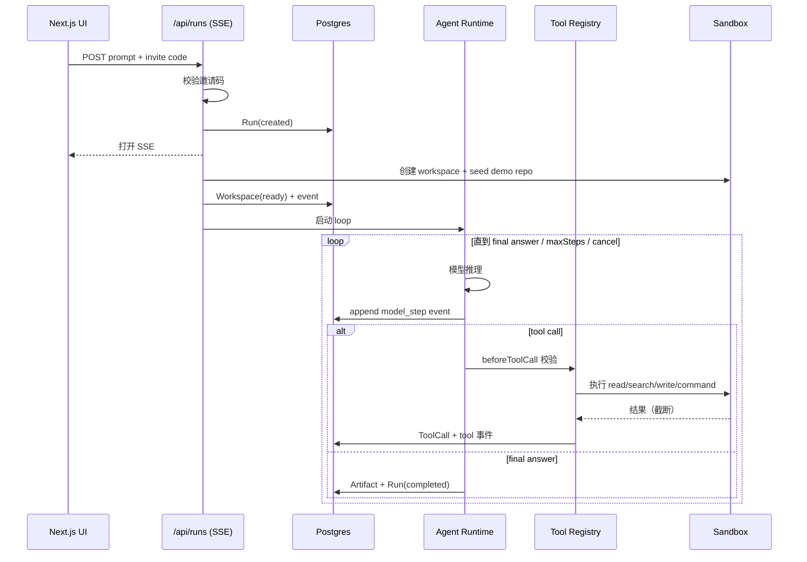

# 技术方案 (Architecture) — Cloud Agent Platform

## 1. 一句话方案

用户提交自然语言任务后，平台创建一次 run，在隔离 sandbox workspace 中启动 agent runtime，通过受控工具读取仓库、搜索文件、执行安全命令、生成报告，并把完整运行事件持久化到 Postgres，前端实时展示 agent 的推理、工具调用和最终结果。

## 2. 三类状态边界（核心设计）

系统刻意区分三类状态，这是整个架构的基石：

| 状态类型 | 内容 | 存储 | 角色 |
| --- | --- | --- | --- |
| 平台状态 | Session / Workspace / Message / Run / AgentEvent / ToolCall / Artifact | Neon Postgres | **唯一事实源** |
| 执行状态 | workspace 文件、临时依赖、命令输出 | Sandbox 文件系统（命名沙箱 + snapshot 支撑会话内持久） | 执行态 |
| 运行时状态 | agent session / transcript | runtime adapter | continuation / debug，不作事实源 |

> agent runtime session、平台 session、sandbox workspace 不是同一个东西。混淆三者是云端 agent 平台失败的常见原因。本项目的「平台 session」= `Session` 表（会话容器），「sandbox workspace」= 沙箱文件系统（由 `Workspace` 表引用），「runtime session」= Pi 内存里的消息数组（不落库为事实源，落库的是 `AgentEvent`）。

> **Agent 与 sandbox 的关系**采用 Sandbox as Tool：agent loop 在 server 跑，沙箱只是工具执行的隔离后端，而非把整个 agent 进程塞进沙箱（Agent in Sandbox）。决策依据见 [ADR-0001](./adr/0001-sandbox-as-tool.md)。

## 3. 技术选型

| 模块 | 选型 | 作用 |
| --- | --- | --- |
| Web / 控制面 | Next.js 16 App Router + Tailwind + React Query + zustand | 任务提交、事件展示、API routes、DB 操作 |
| Agent Runtime | Pi (`@earendil-works/pi-agent-core` + `@earendil-works/pi-ai`) | agent loop、工具调用、session transcript |
| LLM Gateway | pi-ai（仅 OpenAI 兼容协议，自定义 `baseUrl` 指向中转站；无 key 直接报错） | 统一 OpenAI 协议接入 |
| Sandbox | 统一 `Sandbox` 接口 + VercelSandbox 实现 | 隔离执行 workspace |
| Database | Neon Postgres | 平台状态源 |
| ORM | Prisma | schema、migration、类型化查询 |
| 测试 | Vitest | 纯逻辑单元离线；业务集成连真实 LLM + 真实沙箱/DB |
| 部署 | Vercel + Neon | 线上交付 |

**关键选型理由**：

- **Pi**：`Agent` 类提供现成 tool-call 循环；`beforeToolCall` hook 是 policy guard 的天然挂点；`subscribe(event)` 是事件同步的天然挂点；`AgentTool`（TypeBox schema）适配工具系统。
- **沙箱（单一真实实现）**：`Sandbox` 接口借鉴 Vercel Open Agents（MIT）的形状（`readFile/writeFile/stat/mkdir/readdir/exec/stop/getState`）。只实现 `VercelSandbox`（`@vercel/sandbox`，Firecracker microVM）：业务测试与生产都跑在真实沙箱上，确保「测过的就是线上跑的」。保留接口抽象以便未来接入别的隔离后端，但 P0 不做 LocalSandbox。
- **Postgres 事实源**：runtime transcript 易丢失、难查询、难审计；前端展示/恢复/审计都依赖结构化事件流。

## 4. 系统组件

```
src/server/
  db/            Prisma client singleton
  invite/        邀请码服务端校验
  runs/          run 状态机 + run service（create/get/cancel/derivedUiState）
  events/        event store（appendEvent / persistToolCall / persistArtifact）
  sandbox/       Sandbox 接口 / path-guard / local / vercel / factory
  tools/         5 工具 registry + policy guard
  agent/         model 解析 / context 构建 / run-agent 编排
src/app/
  invite/        邀请码门禁页
  api/runs/      创建/查询/取消/SSE 事件流
  (task page)    任务页：表单 + 事件时间线 + 报告面板
```

职责划分：

- **API Route**：创建 session、追加 message/run、查询、读事件、触发 agent worker。只管理状态，不直接执行危险工具。
- **agent**：封装 runtime、agent loop、上下文构建、事件同步。
- **tools**：工具注册、schema 校验、权限控制、输出截断。
- **sandbox**：workspace 创建/复用/resume、命令执行、状态引用。

## 5. 数据模型（P0 七表）

> 完整字段、事件类型、snapshot/resume、与 Open Agents 表对照、P1 演进见 [`data-model.md`](./data-model.md)。下面是概览。

采用多轮会话模型：

```
Session（会话容器）
  ├─ Workspace 1:1   命名沙箱 + snapshot 引用（会话内复用、沙箱回收后恢复）
  ├─ Message[] 1:N   用户 ↔ agent 对话消息
  └─ Run[]     1:N   每次发消息触发一轮执行
       ├─ AgentEvent[]  执行事件流（事实源，@@unique([runId, seq])）
       ├─ ToolCall[]
       └─ Artifact[]
```

```prisma
Session    { id, inviteCodeHash?, title, status(SessionStatus), createdAt, updatedAt }
Workspace  { id, sessionId@unique, provider, status, sandboxName?, sandboxState(Json?),
             snapshotId?, snapshotExpiresAt?, workingDir? }  // 存引用，不存文件系统
Message    { id, sessionId, role(user|assistant), content, runId?, createdAt }
Run        { id, sessionId, userPrompt, status(RunStatus),
             maxSteps, maxDurationSec, lastHeartbeatAt?, ... }
AgentEvent { id, runId, seq, type, role?, content?, raw(Json?), createdAt }
ToolCall   { id, runId, eventSeq, name, status, args(Json), result(Json?), ... }
Artifact   { id, runId, kind, content?, ... }
```

设计原则：热查询字段结构化（sessionId/runId/status/seq）；原始 LLM 输出与工具参数保留 JSON；事件按行追加便于分页/检索/恢复。两层 message 区分：`Message` 是用户视角对话，`AgentEvent` 是某次 Run 的执行细节。

P1 再扩展 User / Project / WorkspaceSnapshot / QueueJob 与自动 hibernate 编排（本期不建表）。

## 6. Agent Loop 编排

单轮循环：

用户在某个 Session 发一条消息，触发一次 Run：

0. 写 user `Message`，建 `Run`，确保 workspace：`getOrCreate(sandboxName)` —— 沙箱活着则复用（文件延续），已被回收则从 `snapshotId` resume 重建。
1. 从 DB 读取 run、必要历史事件、以及 `Session` 的对话历史（喂给 LLM 形成多轮记忆）。
2. 构建 Pi `Agent`：注入 system prompt、对话历史、model、tools（绑定 ToolContext）。
3. Pi 产生下一步动作：assistant message、tool call 或 final answer。
4. 平台把 runtime event 追加写入 `agent_events`（经 `subscribe`）。
5. tool call 先经 `beforeToolCall`（policy guard）校验工具名、参数、路径、命令、超时、权限。
6. 通过后在 sandbox workspace 内执行工具。
7. observation 写回 runtime，同时写入 DB。
8. 每轮开始前检查 DB `cancel_requested`，命中则 `agent.abort()`。
9. 继续循环，直到 final answer、失败或达到 maxSteps / wall time。
10. 完成后解析并写 Markdown 报告为 `Artifact` + assistant `Message`，run 置 `completed`；空闲时 `snapshot()` 保存 workspace 供下次会话 resume。



## 7. 沙箱与隔离

**P0**：一个 Session 绑定一个可复用 workspace；首次从 demo repo 初始化；文件读写限制在 workspace 内；命令执行设 timeout、max output、命令白名单。

`Sandbox` 接口对外暴露 `readFile / writeFile / readdir / exec / stop / getState`，外加 `snapshot()`。唯一实现 VercelSandbox 用 `@vercel/sandbox`：`Sandbox.getOrCreate({ name, persistent })`、`runCommand()`、`readFileToBuffer` / `writeFiles`、`snapshot()`。平台 DB 只保存 sandbox 引用（`sandboxName / sandboxState / snapshotId`），不保存整个文件系统。

**workspace 会话内持久（跨请求、跨沙箱实例）—— snapshot/resume 分层**：

| 层 | 机制 | 范围 |
| --- | --- | --- |
| ① 文件延续 | persistent 命名沙箱，`getOrCreate` 活着复用、死了重建 | P0 必做 |
| ② 快照恢复 | 停止前 `snapshot()`，回来从 `snapshotId` resume | P0 增强 |
| ③ 自动 hibernate 编排 | 定时判断空闲→休眠→lease | P1，不做 |

详见 [`sandbox-research.md`](./sandbox-research.md) 第 5 节。

**生产级演进**：默认禁网、按任务授权；限制 CPU/mem/disk/wall time；overlay 文件系统；secrets 短期 token 注入不落盘；自动 hibernate 生命周期编排。

## 8. 中断、刷新与失败恢复

P0 限制：agent loop 跑在 `POST` invocation 内，SSE 是该 invocation 的输出通道。用户刷新会断开原 SSE 连接，P0 不保证原 loop 继续跑。设计目标不是断线后 100% 后台续跑，而是：

> 所有关键事件落库；刷新后可恢复观察状态；失联可标记 interrupted 并允许重跑。

机制：

- **心跳**：agent loop 在 run 开始、workspace ready、每个 model step、每次 tool call、每隔固定时间更新 `lastHeartbeatAt`。
- **派生 UI 状态**：`GET /api/runs/:id` 据 status + 心跳新鲜度返回 `idle / running / possibly_running / interrupted / completed / failed / cancelled / timeout`。
- **stale 判定**：running 但心跳超阈值（30–60s）→ 标记 `interrupted`。
- **取消**：`cancel_requested` → loop 下一轮前读到 → abort → `cancelled`，已落事件保留。
- **失败**：可恢复小错（文件不存在）作为 tool result 回给模型；系统级错误标记 run `failed` + `error`，已落事件保留。

> DB 是 source of truth，前端不靠浏览器本地状态判断 run 是否存活。

**会话恢复（过几天回来继续对话）**：分两部分——

- **对话上下文**：读 `Session.messages`（DB 永久），100% 恢复，agent 记得之前聊到哪。
- **文件状态**：`getOrCreate(sandboxName)` 发现原沙箱已被 Vercel 回收 → 从 `snapshotId` resume 重建（一次冷启动，落 `workspace_resumed` 事件）→ 文件恢复。

时间线：

```text
Day 0 首条消息  建 Session+Workspace → getOrCreate 新建 → seed demo repo（冷启动）→ 跑 → snapshot
Day 0 多轮追问  沙箱还活着 → getOrCreate 直接复用 → 文件都在（快）
   … 用户离开，沙箱超时被回收 …
Day 2 回来继续  读 DB 对话历史（照常）+ getOrCreate 发现没了 → 从 snapshot resume（一次冷启动）→ 文件恢复 → 继续
```

边界：snapshot 存文件不存运行进程；本项目场景不需要长驻进程。



## 9. 前端状态管理与实时同步

> 详见 [ADR-0004](./adr/0004-frontend-state-management-and-realtime-sync.md)

### 双源数据协调

前端状态来自两个数据源：

1. **SSE 事件流**（`/api/runs/:runId/events`）—— 实时推送执行过程事件
2. **DB 快照**（`/api/sessions/:sessionId`）—— 持久化的会话、消息、runs 数据

**核心原则**：DB 是唯一事实来源（Single Source of Truth），SSE 是实时视图增强（Live View Enhancement）。

### 场景化数据源切换

| 场景 | 初始数据源 | SSE 连接 | 降级策略 |
|------|-----------|----------|---------|
| **S1: 发送新消息** | 乐观渲染 | 立刻连接 `runId` | SSE 失败 → 每 5s 轮询 session |
| **S2: 刷新（run 进行中）** | GET session（DB） | 检测到 `running` → 重连 SSE | 同上 |
| **S3: 刷新（run 已完成）** | GET session（DB） | 无需连接 | N/A |
| **S4: 打开历史 session** | GET session（DB） | 全部完成 → 无需连接 | N/A |

### 弹性降级

- SSE 连接失败/断开：自动重连 3 次（间隔 2s/5s/10s）
- 3 次失败后降级到轮询（每 5s GET session）
- 浏览器休眠恢复：`visibilitychange` 事件触发重连
- 心跳检测：30s 无消息自动重连

### 分层架构

```
┌─────────────────────────────────────────┐
│     UI Layer (React Components)          │
└──────────────┬──────────────────────────┘
               │ useSessionState(sessionId)
┌──────────────▼──────────────────────────┐
│      State Management Layer              │
│  - 合并 DB + SSE 数据                    │
│  - 处理乐观更新                          │
│  - 管理 activeRunId                      │
│  - 降级策略（SSE → Poll → Error）        │
└──────┬───────────────┬──────────────────┘
       │               │
┌──────▼─────┐   ┌────▼─────────────────┐
│ DB Layer   │   │ SSE Layer            │
│ (React     │   │ - 自动重连           │
│  Query)    │   │ - 心跳检测           │
│            │   │ - 错误处理           │
└────────────┘   └──────────────────────┘
```

**边缘情况处理**：多标签页同步（BroadcastChannel）、快速连发消息防护、POST 成功但 SSE 失败、Run 超时/取消、SSE snapshot 不全等 10+ 边缘情况，详见 ADR-0004。

## 10. 上下文管理

四层上下文策略（P0 实现前两层，其余写入演进）：

1. **Recent window**：最近 N 轮完整消息。
2. **Pinned facts**：用户目标、系统约束、当前计划。
3. **Working set**：最近读写的文件、失败命令、重要 tool result。
4. **Retrieval memory**：旧消息/文件/artifact 摘要（P1）。

压缩策略：token 充足保留 recent + working set；接近上限对旧消息做 summary；代码任务中文件内容不长期塞上下文，只留 file reference，需要时重新 `read_file`。

> 上下文压缩可以有损，但平台事件流不能有损。完整历史留在 Postgres，压缩只影响下一轮 prompt。

## 10. 运行位置与时长

P0 不使用 durable workflow，agent loop 直接跑在 Vercel Function 上：`runtime='nodejs'`、`maxDuration=800`。Vercel duration 计入整个 invocation（含等待 streamed response）。Pro/Enterprise 的 Function 时长足以支撑 MVP 级 agent run。

风险控制：maxSteps（60）、每工具 timeout、run 级 wall time buffer、命令输出截断、每步落事件（中途失败 UI 也能看到执行到哪）。示例任务收束为可控场景（读 demo repo、搜 TODO、生成报告）。

## 11. 测试策略

```text
先测纯逻辑 → 工具边界 → agent 状态机 → API/SSE → 端到端 demo
```

| 层级 | 测什么 | 工具 |
| --- | --- | --- |
| Unit（离线） | 状态机、path guard、policy、event seq、凭据解析 | Vitest，零外部依赖 |
| Integration（真基建） | 工具、run-agent、DB CRUD | Vitest + **真实 LLM** + **真实 Vercel 沙箱** + Neon |
| API | invite 校验、创建 run、cancel、reload、SSE | route handler tests（连真沙箱/DB） |
| E2E | prompt → 事件 → 报告 | 1 条 happy path |

**沙箱与 DB 一律用真实的，LLM 连真实中转站**——所有业务流程都在真实 Vercel 沙箱 + Neon + 真实 LLM 上测过，后端全绿才开前端。

> 两层依赖：纯逻辑单元测试零外部依赖（无 key / 无网络也全绿）；业务集成测试需 Vercel 凭据与网络（本机被墙时走代理，部署在 Vercel 上无此问题）。

## 12. P0 / P1 / P2 演进

| 维度 | P0（本期） | P1 | P2 |
| --- | --- | --- | --- |
| 执行 | Function 内联 loop + SSE | Queue + worker，断线续跑 | 多 worker autoscaling |
| 沙箱 | 命名沙箱复用 + snapshot/resume（①②） | 自动 hibernate 编排（③）、多份历史快照 | overlay FS、network policy |
| 状态 | session/message/run/event/tool/artifact | + 多份 snapshot / lease | + 多租户/team |
| 接入 | demo repo | git clone / branch / diff | GitHub App / PR / preview |
| 安全 | path guard / 白名单 / 截断 | human approval | secrets manager |
| 扩展 | 多轮会话 | retry / 并发控制 | subagent / 向量记忆 / billing |

## 13. 取舍与参考

**MVP 不做**：多租户权限、完整计费、大规模 worker 调度、复杂 workspace resume、任意 shell、长期 memory 产品化。原因：笔试考 Cloud Agent Platform 的边界与系统设计，不考 auth / billing；这些会吞掉大量时间。

**参考**：架构参考 Vercel Open Agents (MIT) 的三层边界（Web → Agent Workflow → Sandbox VM）与 `Sandbox` 接口形状；基于 Pi (MIT) runtime 构建。本项目从零实现一个更小的任务收束版本，不复制源码、UI 或完整功能，保留开源出处声明。
